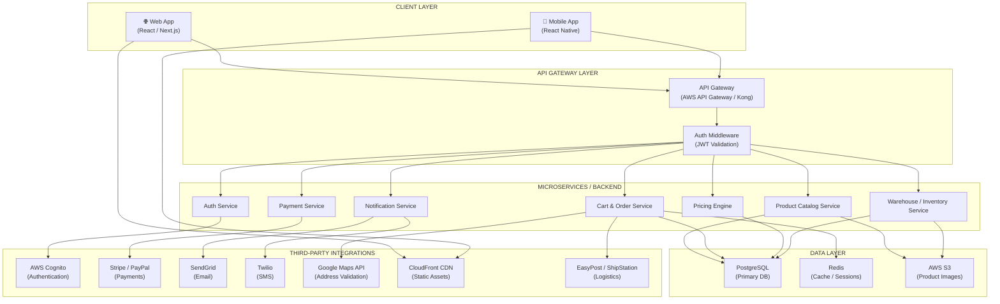
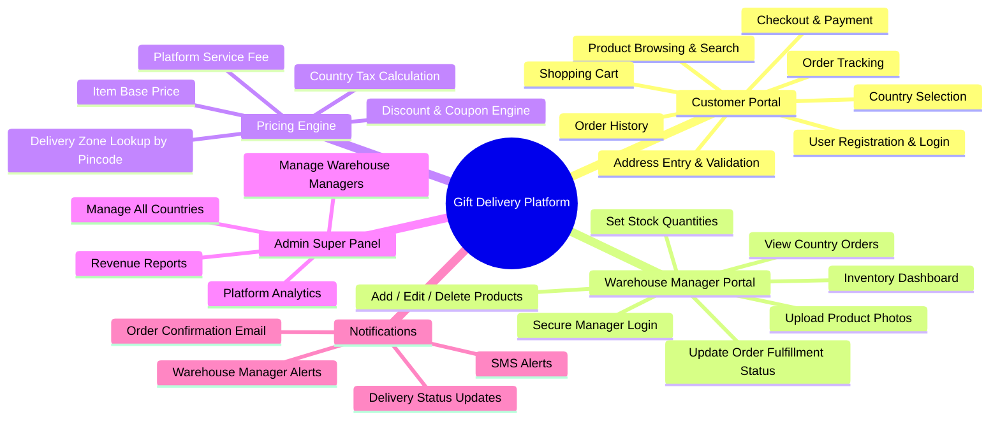
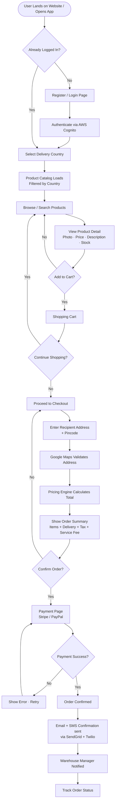
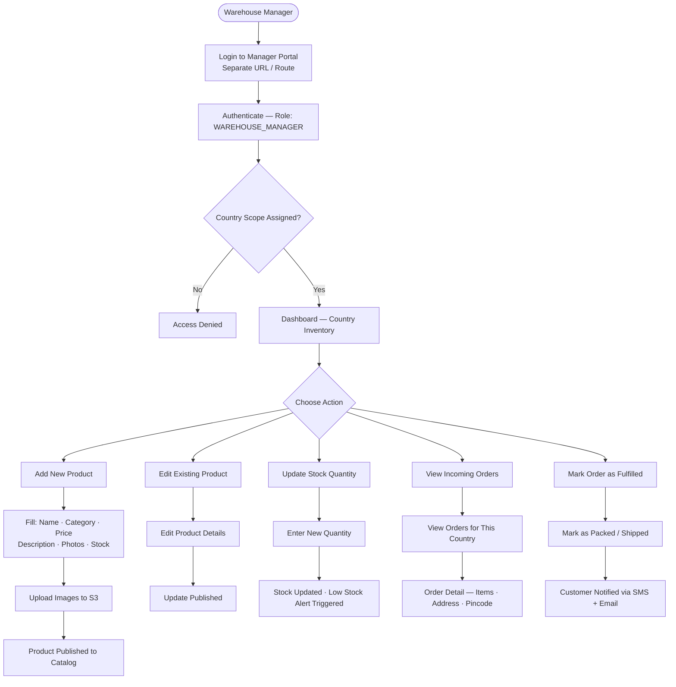
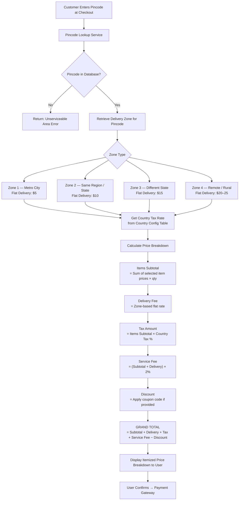
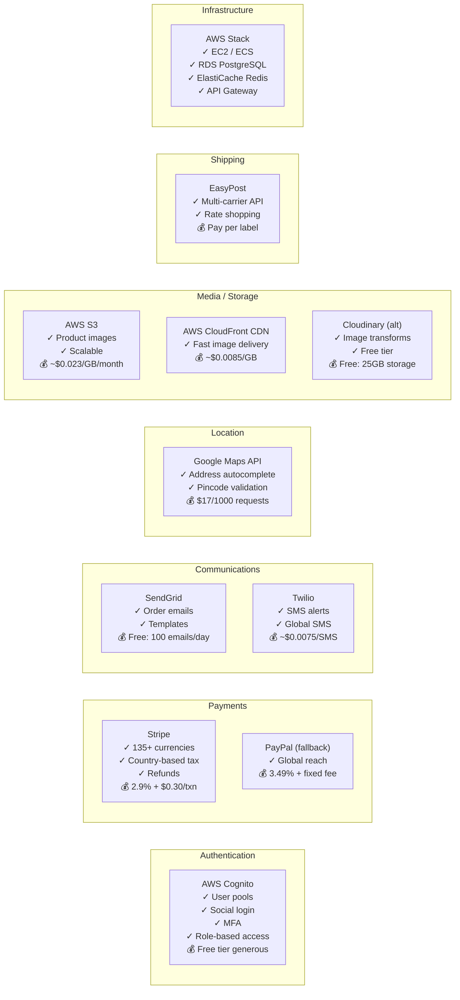
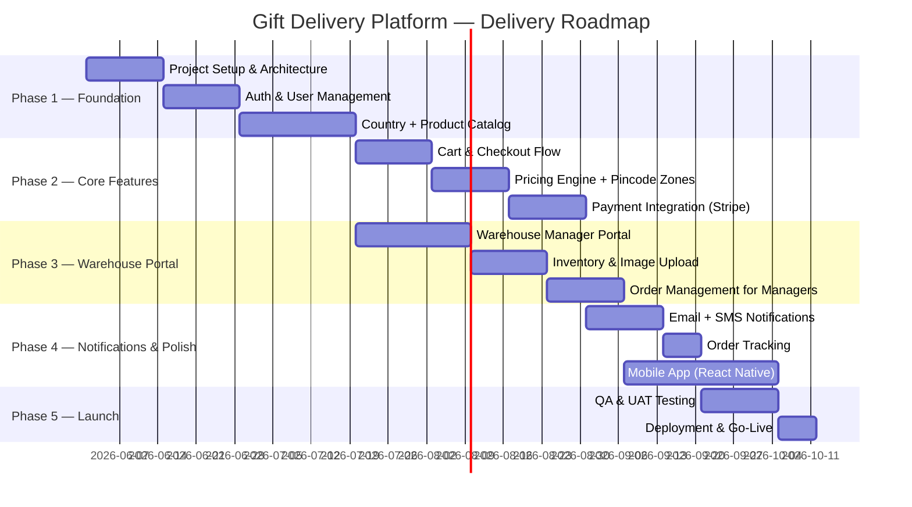

# Gift Delivery Platform — Business Requirements Diagram

> **Purpose:** Client-facing overview of the platform architecture, user flows, modules, third-party integrations, and pricing engine logic.

---

## 1. System Architecture Overview

---

## 2. Platform Modules

---

## 3. Customer User Flow

---

## 4. Warehouse Manager Flow

---

## 5. Pricing Engine — How Price is Calculated

### Price Formula Reference

| Component | Calculation |
|-----------|-------------|
| **Items Subtotal** | `Σ (item_price × quantity)` |
| **Delivery Fee** | Zone lookup by pincode → flat rate |
| **Tax** | `items_subtotal × country_tax_rate` |
| **Service Fee** | `(subtotal + delivery) × 0.02` (2%) |
| **Coupon Discount** | Fixed amount or `subtotal × discount_%` |
| **Grand Total** | `subtotal + delivery + tax + service_fee − discount` |

---

## 6. Third-Party Tools & Integrations

---

## 7. Role Summary

| Role | Access | Scope |
|------|--------|-------|
| **Customer** | Web + Mobile App | Own orders, own profile |
| **Warehouse Manager** | Manager Portal (Web) | Products + Orders for assigned country only |
| **Super Admin** | Admin Panel | All countries, all managers, analytics |

---

## 8. High-Level Delivery Timeline

---

*This diagram is generated for client presentation. Refer to `DETAILED_PLAN.md` for full technical specifications.*
